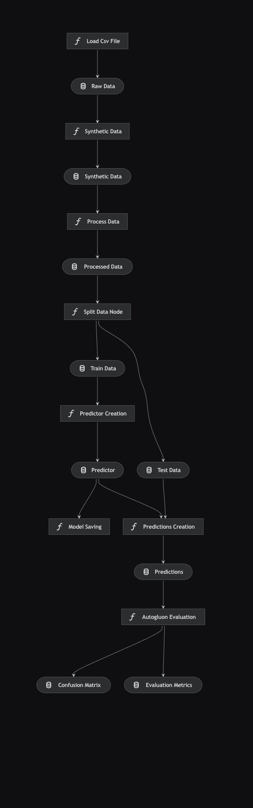
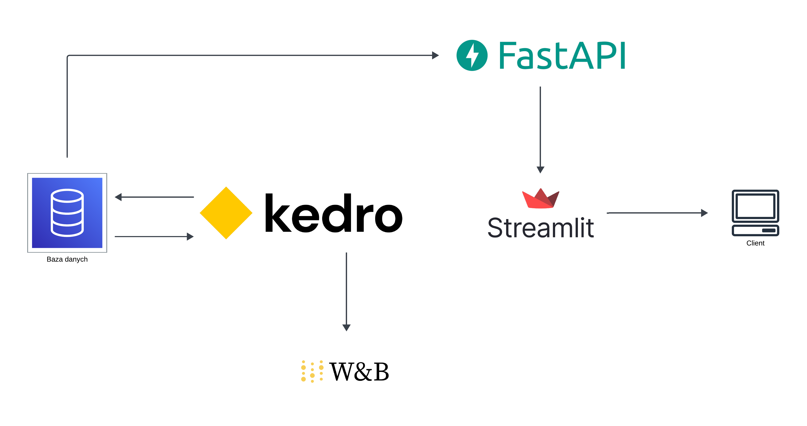

# Projekt z przedmiotu “Architektury rozwiązań i wdrożeń SI”

Streamlit app will be open in browser on URL http://localhost:8501/ and you will be able to manage software from this web panel.

## Churn modelling

Autorzy:
* Konrad Reperowski
* Barnaba Gańko
* Adam Kwiecień

Projekt służy do tworzenia modeli do predykcji rezygnacji z usługi konta bankowego na podstawie danych dostępnych w serwisie [Kaggle](https://www.kaggle.com/code/simgeerek/churn-prediction-using-machine-learning/input). 


Projekt korzysta z:
* SQLite - baza danych
* Kedro - zarządzanie danymi oraz pipeline'ami
* Kedro Viz - wizualizacja pipeline'ów
* AutoGluon - dostosowanie modeli
* WandDB - śledzenie i wizualizacja treningu modeli
* SDV - generator syntetycznych danych
* FastAPI - tworzenie API i interakcji z modelem
* Streamlit - prosty interfejs użytkownika

### Aktywacja środowiska wirtualnego: 
```bash
source .venv/bin/activate
```

### Dezaktywacja środowiska wirtualnego: 
```bash
deactivate
```

### Baza danych

* CREDENTIALS=db-credentials
* TABLE_NAME=raw_data
* TRAIN_TABLE_NAME=train_data
* TEST_TABLE_NAME=test_data
* EVALUATION_TABLE_NAME=evaluation_metrics
* CONFUSION_MATRIX_TABLE_NAME=confusion_matrix
* SYNTH_TABLE_NAME=synth_data

## Instalacja i uruchomienie

```bash
pip install -r requirements.txt
```

```bash
python launcher.py script
```

## Wizualizacja pipeline'ów

```bash
cd churn-modelling-kedro
kedro viz
```



## Architektura projektu

